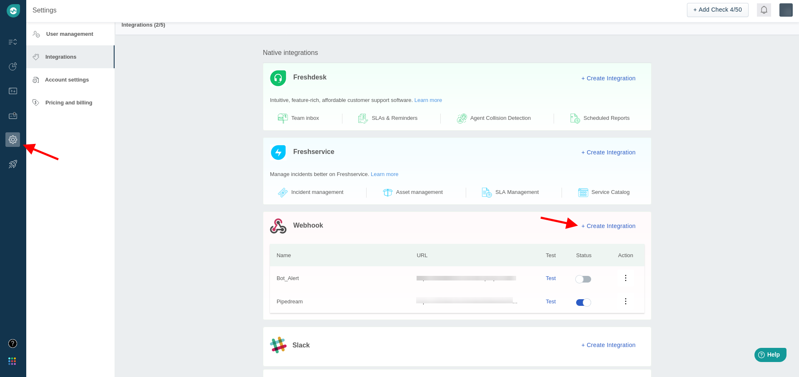
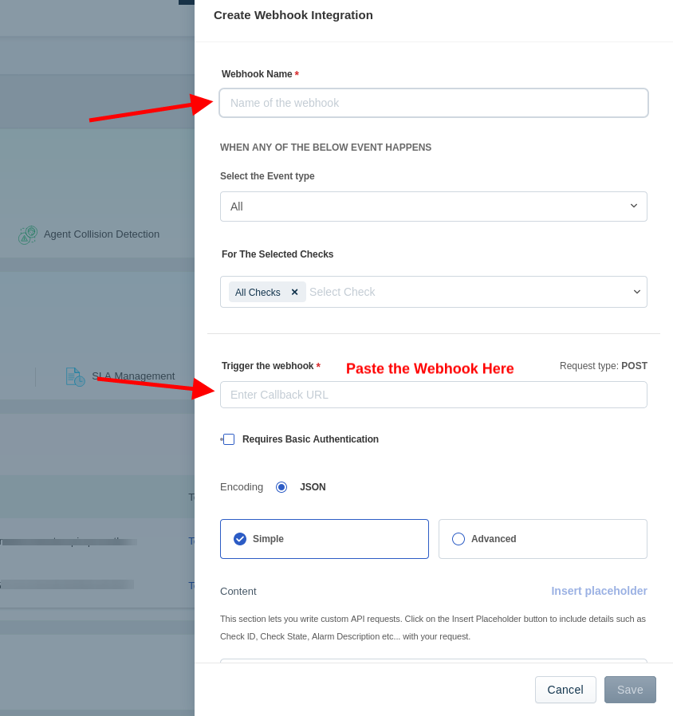
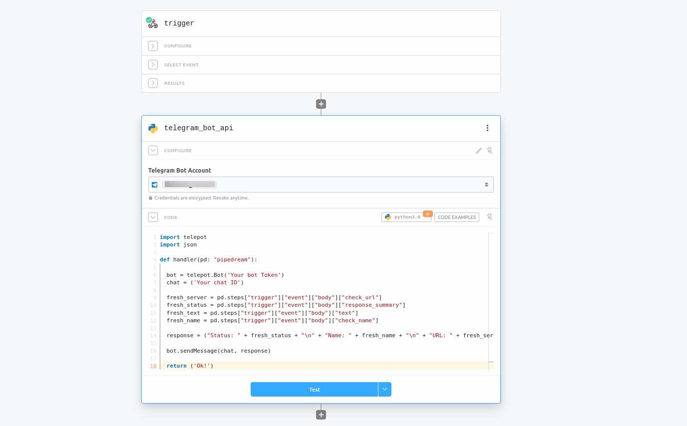
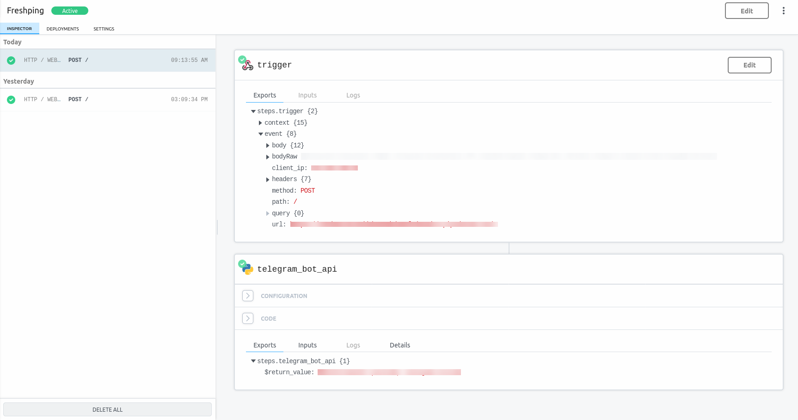

# How to connect Freshping and Pipedream

I made a simple code to notify you in a telegram chat whenever a server is down. See how to integrate   (Attention: This is a quick tutorial)
 

### How does it work?
Basically, the program receives a Json file from Freshping, with the offline server information. After that, the Pipedream Webhook is triggered and processes the information to send it on the specified telegram channel.
  

## Creating a webhook in Freshping

Create an account on the platform https://www.freshworks.com/website-monitoring/ and follow the steps     

01- Go to settings, and click create a webhook  

 
 

02- Paste the webhook created in Pipedream into the marked field  

 
 

03- Ok, now your webhook is set up. Go to your Workflow in Pipedream, and paste the code available in the repository  

 
 

Here is an example of how your Workflow should look  

 
 

### Created by Marco Barsotini ;)
